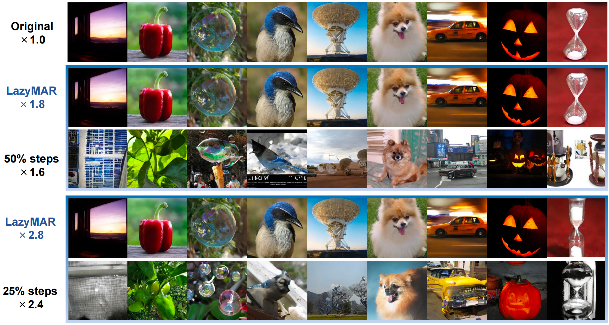

<div align=center>
  
# *LazyMAR*: Accelerating Masked Autoregressive Models via Feature *Ca*ching

## <font size=6>🎉 Accepted to ICCV 2025 🎉</font>

<p>
<a href='https://openaccess.thecvf.com/content/ICCV2025/html/Yan_LazyMAR_Accelerating_Masked_Autoregressive_Models_via_Feature_Caching_ICCV_2025_paper.html'></a>
<a href='https://github.com/feihongyan1/LazyMAR'></a>
<a href='https://iccv2025.thecvf.com/'></a>
</p>

</div>

## 📖 Abstract

Masked Autoregressive (MAR) models have emerged as a promising approach in image generation, expected to surpass traditional autoregressive models in computational efficiency by leveraging the capability of parallel decoding. However, their dependence on bidirectional self-attention inherently conflicts with conventional KV caching mechanisms, creating unexpected computational bottlenecks that undermine their expected efficiency. 

To address this problem, this paper studies the caching mechanism for MAR by leveraging two types of redundancy: 
- **Token Redundancy** indicates that a large portion of tokens have very similar representations in the adjacent decoding steps, which allows us to first cache them in previous steps and then reuse them in the later steps. 
- **Condition Redundancy** indicates that the difference between conditional and unconditional output in classifier-free guidance exhibits very similar values in adjacent steps. 

Based on these two redundancies, we propose **LazyMAR**, which introduces two caching mechanisms to handle them one by one. LazyMAR is training-free and plug-and-play for all MAR models. Experimental results demonstrate that our method achieves **2.83×** acceleration with almost no drop in generation quality.

<div align=center>

</div>

##  📋 Dependencies

- Python >= 3.8
- CUDA >= 11.8
- PyTorch >= 2.2.2

## 🛠 Installation

Download the code:

```bash
git clone https://github.com/feihongyan1/LazyMAR.git
cd LazyMAR
```

### Environment Setup

A suitable [conda](https://conda.io/) environment named `lazymar` can be created and activated with:

```bash
conda env create -f environment.yaml
conda activate lazymar
```

### Pre-trained Models

Download pre-trained VAE and LazyMAR models (weights are provided by [MAR](https://github.com/LTH14/mar)):

| LazyMAR Model | FID-50K | Inception Score | #params | Download Link |
|---------------|---------|-----------------|---------|---------------|
| [LazyMAR-B](https://www.dropbox.com/scl/fi/f6dpuyjb7fudzxcyhvrhk/checkpoint-last.pth?rlkey=a6i4bo71vhfo4anp33n9ukujb&dl=0) | 2.45 | 281.3 | 208M | [Dropbox](https://www.dropbox.com/scl/fi/f6dpuyjb7fudzxcyhvrhk/checkpoint-last.pth?rlkey=a6i4bo71vhfo4anp33n9ukujb&dl=0) |
| [LazyMAR-L](https://www.dropbox.com/scl/fi/pxacc5b2mrt3ifw4cah6k/checkpoint-last.pth?rlkey=m48ovo6g7ivcbosrbdaz0ehqt&dl=0) | 1.93 | 297.4 | 479M | [Dropbox](https://www.dropbox.com/scl/fi/pxacc5b2mrt3ifw4cah6k/checkpoint-last.pth?rlkey=m48ovo6g7ivcbosrbdaz0ehqt&dl=0) |
| [LazyMAR-H](https://www.dropbox.com/scl/fi/1qmfx6fpy3k7j9vcjjs3s/checkpoint-last.pth?rlkey=4lae281yzxb406atp32vzc83o&dl=0) | 1.69 | 299.2 | 943M | [Dropbox](https://www.dropbox.com/scl/fi/1qmfx6fpy3k7j9vcjjs3s/checkpoint-last.pth?rlkey=4lae281yzxb406atp32vzc83o&dl=0) |

**VAE Model**: Download the pre-trained VAE model from [Dropbox](https://www.dropbox.com/scl/fi/hhmuvaiacrarfg28qxhwz/kl16.ckpt?rlkey=l44xipsezc8atcffdp4q7mwmh&dl=0)

Place the downloaded checkpoints in `pretrained_models/` directory:
```
pretrained_models/
├── mar/
│   ├── mar_base/
│   │   └── checkpoint-last.pth
│   ├── mar_large/
│   │   └── checkpoint-last.pth
│   └── mar_huge/
│       └── checkpoint-last.pth
└── vae/
    └── kl16.ckpt
```

## 🚀 Run and Evaluation

### Image Generation with LazyMAR

Generate 50k images for evaluation on ImageNet-256:

```bash
CUDA_VISIBLE_DEVICES=0,1 torchrun --master_port=26586 --nproc_per_node=2 \
  --nnodes=1 --node_rank=0 eval.py \
  --num_images 50000 \
  --eval_bsz 128 \
  --num_iter 64 \
  --lazy_mar
```

### Baseline MAR (without LazyMAR)

To compare with the baseline MAR model without acceleration:

```bash
CUDA_VISIBLE_DEVICES=0,1 torchrun --master_port=26586 --nproc_per_node=2 \
  --nnodes=1 --node_rank=0 eval.py \
  --num_images 50000 \
  --eval_bsz 128 \
  --num_iter 64
```

### Key Arguments

- `--lazy_mar`: Enable LazyMAR acceleration (training-free and plug-and-play)
- `--num_iter`: Number of autoregressive iterations (default: 64)
- `--eval_bsz`: Batch size for evaluation (default: 128)
- `--num_images`: Number of images to generate (default: 50000)
- `--model`: Model architecture choice: `mar_base`, `mar_large`, or `mar_huge` (default: `mar_huge`)
- `--cfg`: Classifier-free guidance scale (default: 3.25)

## 📊 Performance

LazyMAR achieves significant speedup while maintaining generation quality on ImageNet 256×256 class-conditional generation.

**Testing Hardware**: NVIDIA GeForce RTX 3090 GPU

### Main Results (64 Decoding Steps)

| Model | Latency (GPU) | Latency (CPU) | FLOPs | Speedup | FID ↓ | IS ↑ |
|-------|---------------|---------------|-------|---------|-------|------|
| **MAR-H** | 1.74s | 116.61s | 69.06T | 1.00× | 1.59 | 299.1 |
| **LazyMAR-H** | **0.75s** | **43.12s** | **24.38T** | **2.83×** | **1.69** | **299.2** |
| **MAR-L** | 0.93s | 59.66s | 35.05T | 1.00× | 1.82 | 296.1 |
| **LazyMAR-L** | **0.40s** | **22.82s** | **12.52T** | **2.80×** | **1.93** | **297.4** |
| **MAR-B** | 0.47s | 28.97s | 15.49T | 1.00× | 2.32 | 281.1 |
| **LazyMAR-B** | **0.21s** | **11.08s** | **5.54T** | **2.80×** | **2.45** | **281.3** |

## 🎯 Key Features

- **⚡ High Acceleration**: Achieves 2.83× speedup with 64.7% FLOPs reduction and minimal quality loss
- **🔌 Training-Free & Plug-and-Play**: No retraining required, simple integration via `--lazy_mar` flag
- **💡 Dual Caching Mechanisms**: Leverages both token redundancy and condition redundancy
- **💾 Memory Efficient**: Intelligent caching reduces redundant computations

## 👍 Acknowledgements

- Thanks to [MAR](https://github.com/LTH14/mar) for their great work and codebase upon which we build LazyMAR.
- Thanks to the community for the pre-trained VAE models.

## 📧 Contact

If you have any questions, feel free to contact us through email: 

**📮 [3120235162@bit.edu.cn](mailto:3120235162@bit.edu.cn)**

## 📌 Citation

If you find our work useful, please consider citing:

```bibtex
@InProceedings{Yan_2025_ICCV,
    author    = {Yan, Feihong and Wei, Qingyan and Tang, Jiayi and Li, Jiajun and Wang, Yulin and Hu, Xuming and Li, Huiqi and Zhang, Linfeng},
    title     = {LazyMAR: Accelerating Masked Autoregressive Models via Feature Caching},
    booktitle = {Proceedings of the IEEE/CVF International Conference on Computer Vision (ICCV)},
    month     = {October},
    year      = {2025},
    pages     = {15552-15561}
}
```

## 📄 License

This project is licensed under the MIT License - see the [LICENSE](LICENSE) file for details.

Enjoy!

---

<div align=center>
<b>⭐ If you find this project helpful, please consider giving it a star! ⭐</b>
</div>

